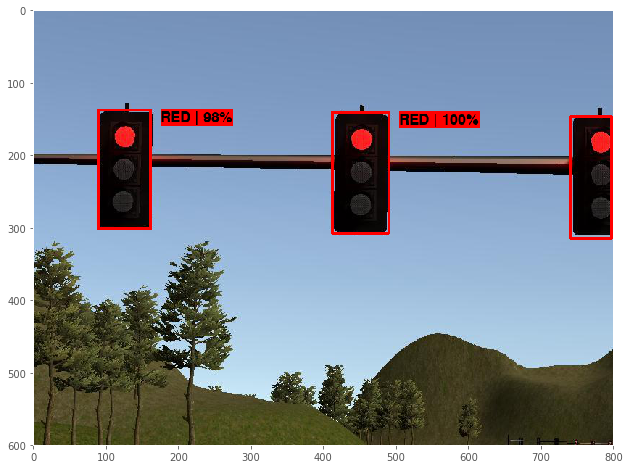
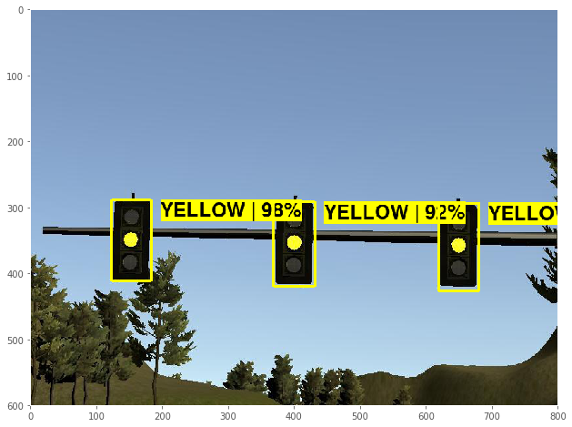
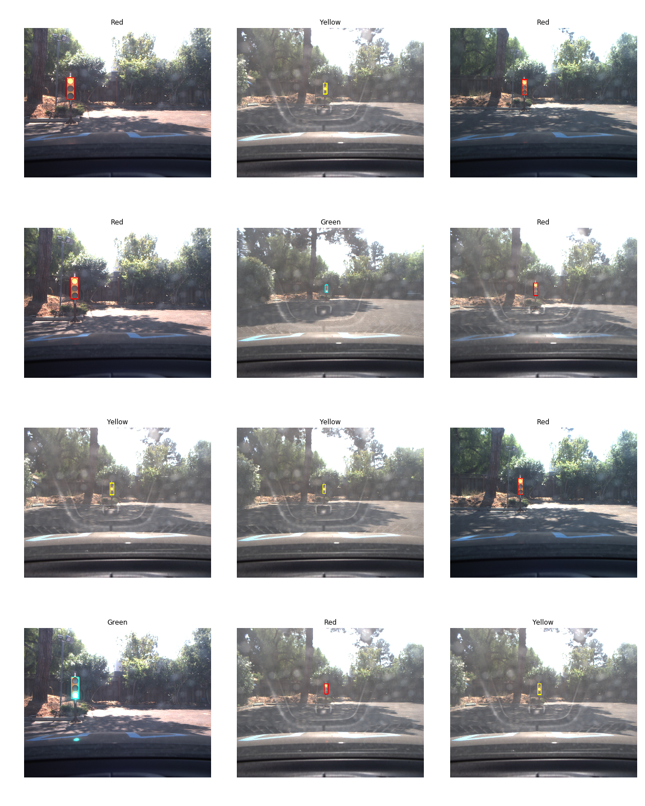
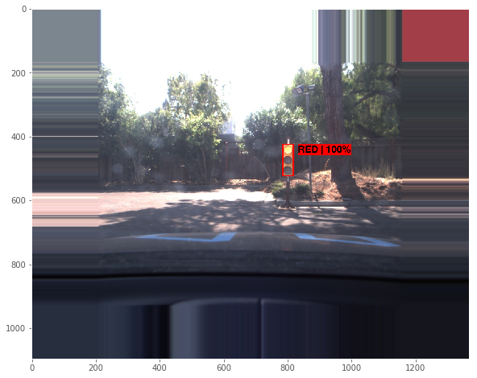
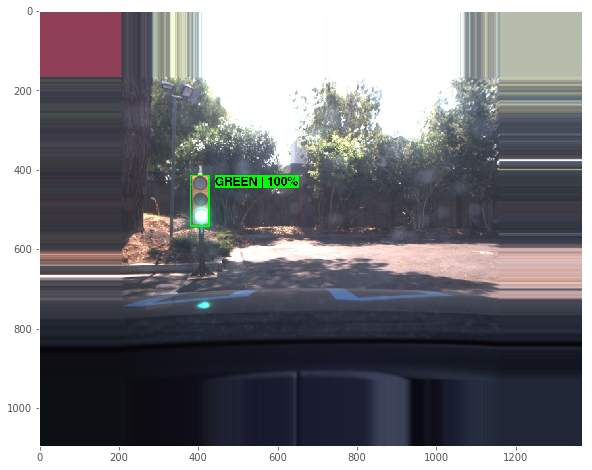

# Self-Driving Car using ROS  
#### Udacity Self-Driving Car Engineer Nanodegree --- Capstone Project

## Software Architecture
  

Note that obstacle detection is not implemented for this project.


## Traffic Light Detection Node

A large part of the project is to implement a traffic light detector/classifier that recognizes 
the color of nearest upcoming traffic light and publishes it to /waypoint_updater node so it can prepare 
the car to speed up or slow down accordingly. Because the real world images differ substantially from simulator images, 
we tried out different approaches for both. The approaches which worked best are described below.

### OpenCV Approach
#### Simulator (Highway)
In this approach I used the basic features of OpenCV to solve the problem, the steps are described below.
* Image is transformed to HSV colorspace, as the color feature can be extracted easily in this colorspace.
* Mask is applied to isolate red pixels in the image. 
* Contour detection is performed on the masked image.
* For each contour, area is checked, and, if it falls under the approximate area of traffic light, 
polygon detection is performed and checked if the the number of sides is more than minimum required closed loop polygon. 
* If all the above conditions satisfy there is a red sign in the image. 

##### Pros
* This approach is very fast.
* Uses minimum resources.

##### Cons
* This is not robust enough, the thresholds need to be adjusted always.
* Doesnt work properly on real world data as there is lot of noise. 

### SSD Approach (Single Shot Detection)
I need to solve both object detection - where in the image is the object, 
and object classification --- given detections on an image, classify traffic lights. 
While there are teams who approached it as 2 separate problems to be solved, 
recent advancements in Deep Learning has developed models that attempt to solve both at once.
For example, SSD (Single Shot Multibox Detection) and YOLO (You Only Look Once).
#### Simulator (Highway)
Here I experimented with Tensorflow Object Detection API, using pretrained models on COCO dataset, such as:
"ssd_inception_v2_coco" and "ssd_mobilenet_v2_coco":
* Testing the coco pretrained models without retraining on simulator images didn't lead to any success, 
since the simulated traffic lights look very different from real traffic lights, and hence we concluded, 
that if I was going to use this approach on the simulator, I would need a different model specifically
retrained on the simulator images. 
* So we decided to utilize transfer learning, and retrain the models on images extracted from the simulator, 
using 3 classes/labels only; Red, Yellow and Green.
* I choose the "ssd_inception_v2_coco model", since it proved to be a good compromise between speed and accuracy, 
and retrained it on the simulator images dataset provided by Alex Lechner
[here](https://github.com/alex-lechner/Traffic-Light-Classification/blob/master/README.md#1-the-lazy-approach).

Sample dataset for simulator images


* The configuration parameters for retraining was: 
    * num_classes: 3.
    * fixed_shape_resizer: 300x300, to reduce training time, since using larger image sizes during
training didn't seem to increase the inference accuracy.
    * Dropout: True.
    * batch_size: 24.
    * num_steps: 20000, which experimentally proved to lead to good results.
* The training took around 3.5 hours on an NVIDIA GTX 1070 (tensorflow-gpu == 1.4.0), 
and the final training loss was around 2.x.
* The retraining of the model lead to very good results; confidence levels reaching up to 0.999
even when the car is very far away from the traffic light:

Here are the results of my trained model.




##### Pros
* This approach is very accurate.
* It can detect all 3 colors; Red, Yellow & Green, with great confidence.
* It can pinpoint the exact position and size of the lights, which can be further utilized
for accurately calculating the stopping line position.

##### Cons
* It's slower than OpenCV method.

#### Real World (Test Lot)
* I tested the pretrained models without retraining, on real world images from the ROS bags
provided by Udacity, which led to some success, since COCO dataset already has a Traffic Light
class (No.10), however it was a limited success since the ROS bags images had unusual lighting;
very bright in some cases, and often the 3 light colors were not distinguishable from one another
and all looked somewhat yellow.
* Similarly we opted for retraining the "ssd_inception_v2_coco" model, but this time I compiled
our own dataset, since datasets found online didn't lead to good enough results, so I labeled
images from 3 different ROS bags provided by Udacity and added images from Bosch Small Traffic Lights
Dataset [here](https://hci.iwr.uni-heidelberg.de/node/6132), which helped the model generalize better, 
and increased the detection confidence specially for instances when the traffic light was far away, 
since most images in the ROS bags have the traffic light in close proximity.

Here is a sample of the dataset.


* The configuration parameters for retraining was: 
    * num_classes: 3.
    * fixed_shape_resizer: 300x300.
    * Dropout: True.
    * batch_size: 24.
    * num_steps: 100000, here we increased the number of steps, since each step processesbatch_size images, 
so for example if we double the number of samples in the dataset, I will need to double the number of steps 
to achieve the same number of epochs, each epoch requires = (no. samples / batch_size) steps, and in this 
combined dataset I had around 22,000 samples/images.
* The results were good reaching to a confidence of 1.0 most of the time, but in some instances 
the model completely fails specially when the traffic light is very close to the camera.

Here are the results of our trained model.




##### Pros
* This approach is accurate in most cases.
* It can detect all 3 colors; Red, Yellow & Green, with great confidence.
* It can pinpoint the exact position and size of the lights, which can be further utilized 
for accurately calculating the stopping line position.

##### Cons
* It's not very fast, the FPS when running the ROS bag was averaging 15 FPS.
* It requires a very large dataset including images of different lighting conditions, 
different distances from the lights, etc, in order to be reliable.

### YOLOv3-tiny (You Only Look Once)
#### Real World (Test Lot)
We used this approach for real world.
TODO:write about it


### Dataset


#### Image Collection
We used images from 3 ROS bags provided by Udacity:
* [traffic_lights.bag](https://s3-us-west-1.amazonaws.com/udacity-selfdrivingcar/traffic_light_bag_file.zip)
* [just_traffic_light.bag](https://drive.google.com/file/d/0B2_h37bMVw3iYkdJTlRSUlJIamM/view?usp=sharing) 
* [loop_with_traffic_light.bag](https://drive.google.com/file/d/0B2_h37bMVw3iYkdJTlRSUlJIamM/view?usp=sharing)


#### Image Extraction
As described in 
[How to export image and video data from a bag file](http://wiki.ros.org/rosbag/Tutorials/Exporting%20image%20and%20video%20data),
we:
```xml
<!--Replace <path-to-your-ros-bag> with the actual path to your ROS bag from which you want to extract images.-->
<!--Replace <topic> with the actual topic that contains images of your interest.-->
<launch>
  <node pkg="rosbag" type="play" name="rosbag" required="true" args="<path-to-your-ros-bag>"/>
  <node name="extract" pkg="image_view" type="extract_images" respawn="false" required="true" output="screen" cwd="ROS_HOME">
    <remap from="image" to="<topic>"/>
  </node>
</launch>
```
1. Prepared the environment by executing: `roscd image_view && rosmake image_view --rosdep-install`.
2. Created an `extract-images-from-ros-bag.launch` file (above).
    - For [traffic_lights.bag](https://s3-us-west-1.amazonaws.com/udacity-selfdrivingcar/traffic_light_bag_file.zip) 
      ROS bag we used `/image_color` topic.  
    - For [just_traffic_light.bag](https://drive.google.com/file/d/0B2_h37bMVw3iYkdJTlRSUlJIamM/view?usp=sharing) and
      [loop_with_traffic_light.bag](https://drive.google.com/file/d/0B2_h37bMVw3iYkdJTlRSUlJIamM/view?usp=sharing) 
      we used `/image_raw` topic.
3. Ran: `roslaunch extract-images-from-ros-bag.launch`.
4. Created a folder to keep extracted images in: `mkdir <folder>`.
5. Moved extracted images to the newly created folder: `mv ~/.ros/frame*.jpg <folder>`


#### Video Creation
I extracted images from the ROS bags in the [Image Extraction](#image-extraction) step and converted them to videos
following the instructions from 
[How to export image and video data from a bag file](http://wiki.ros.org/rosbag/Tutorials/Exporting%20image%20and%20video%20data).  
We:  
1. Prepared the environment by executing: `sudo apt install mjpegtools`.
2. Ran:
`ffmpeg -framerate 25 -i <folder>/frame%04d.jpg -c:v libx264 -profile:v high -crf 20 -pix_fmt yuv420p <output>`,
where `<folder>` is a directory with files extracted from a particular ROS bag and `<output-name>` is a desired name 
for your MP4 videos file (the file should have the `.mp4` extension).


    
### Other approaches for traffic light detection

I experimented with few other (unsuccessful) approaches to detect traffic lights. 

#### Idea

The idea is to use the entire image with a given traffic light color as an individual class. This means I will have 4 classes

 1. Entire image showing `yellow` traffic sign 
 2. Entire image showing `green` traffic sign 
 3. Entire image showing `red` traffic sign 
 4. Entire image showing `no` traffic sign 

#### Models

I trained couple of models:

1. A simple CNN with two convolutional layers, a fully connected layer and an output layer. The initial results looked promising with `training accuracy > 97%` and `test accuracy > 90%`. However when we deployed and tested the model, the results were not consistent. The car did not always stop at red lights and sometimes it did not move even when the lights were green. Efforts to achieve higher accuracies were in vain. 

2. Used transfer learning for multi-class classification approach using `VGG19` and `InceptionV3` models, using `imagenet` weights. The network did not learn anything after `1-2` epochs and hence the training accuracy never exceeded `65%`.


### Acknowledgements

- I would like to thank Udacity for providing the instructional videos and learning resources.
- I would like to thank Alex Lechner for his wonderful tutorial on how to do transfer learning on TensorFlow Object Detection API research models and get it to run on older tensorflow versions, as well as providing datasets. You can view his readme here: https://github.com/alex-lechner/Traffic-Light-Classification/blob/master/README.md#1-the-lazy-approach
